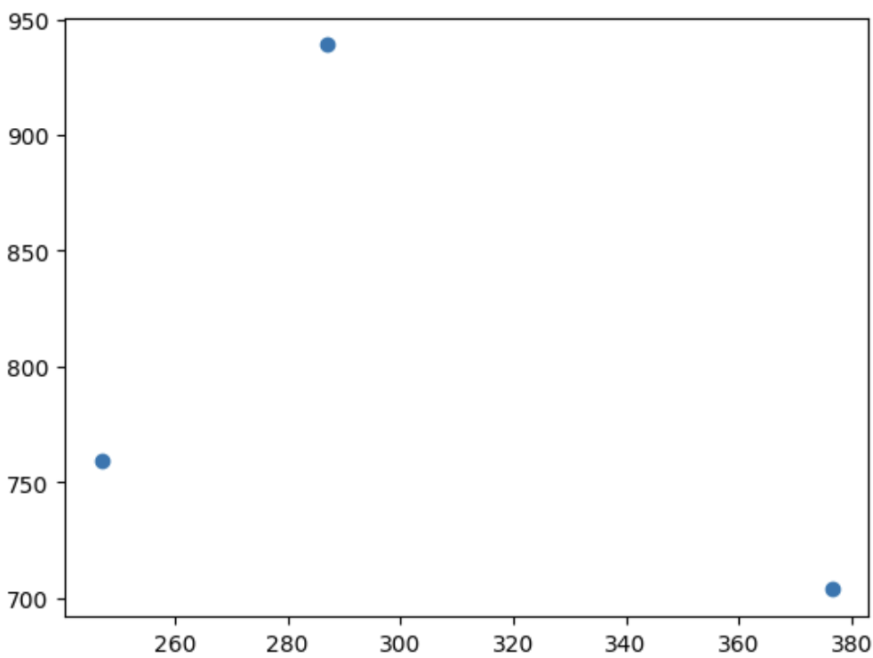
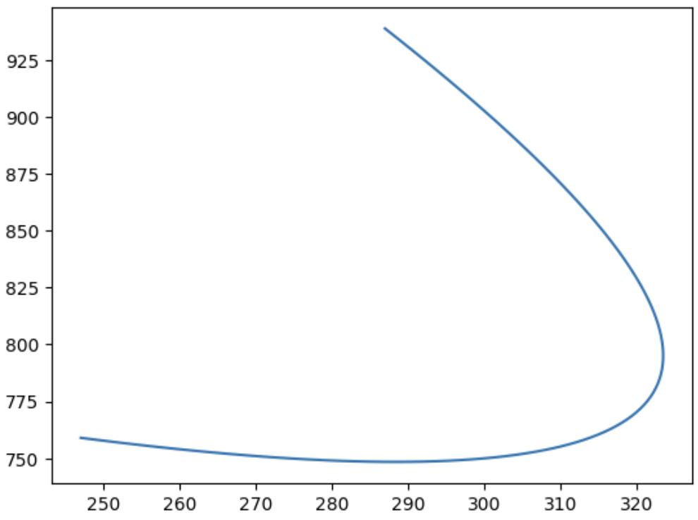
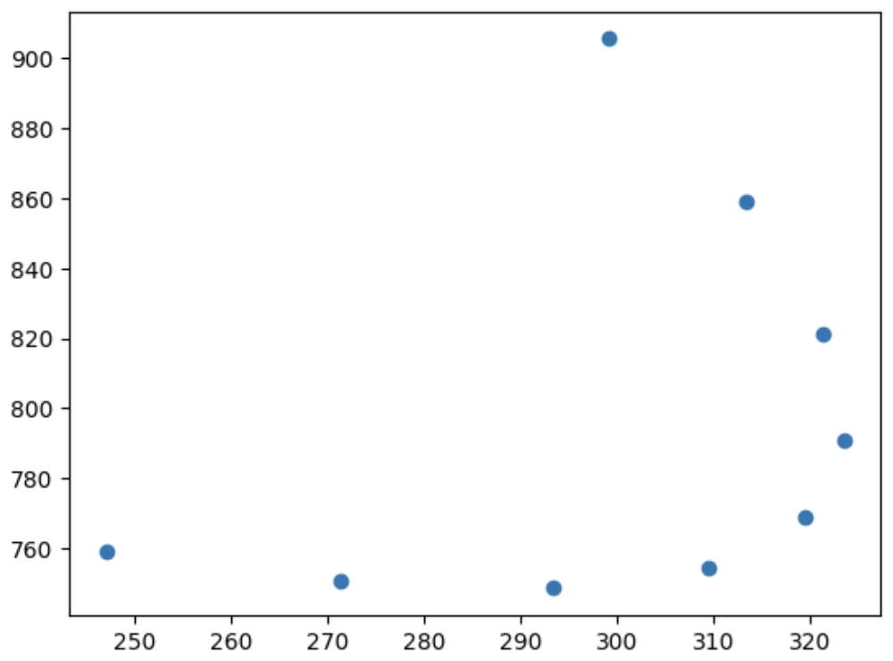
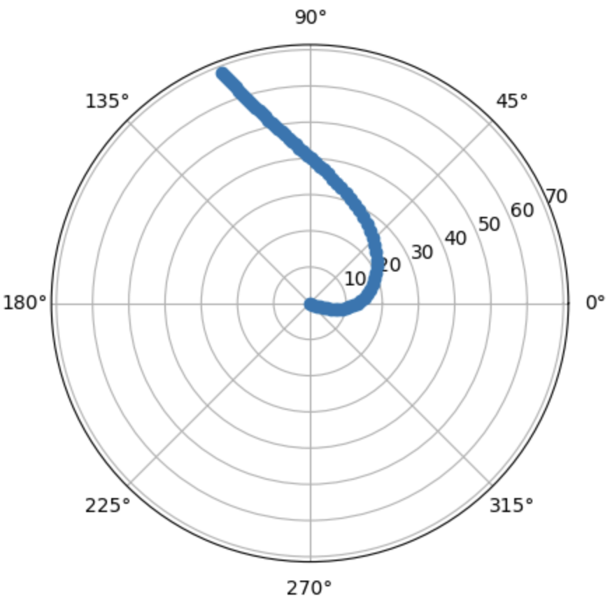

# Simulation of Flying Objects
This project is a simulation of flying objects in a 2D world. 
The objects have specific properties, and a REST API is implemented to query and retrieve data from the simulation.

## Getting started
Setup your environment with the `make setup` command.

To start the simulation use the `make run` command.

To start the endpoint use the `make app` command.

You can adjust configurations in the `src/config.py` file.

## Visual Results

`Initial Point, Waypoint and Destination (more details in the "Main Obejects" section)`



`Bezier curve for the abovementioned point`



`Drone Trajectory`



`Angle`




## Example responses

> /details (lists the objects available and example queries)
```json
[
    {
    "object_id": "0031e338333d410fa0d346ca36876f5e",
    "min_timestamp": "2006-12-01 15:58:20",
    "max_timestamp": "2006-12-01 17:03:20",
    "example_trajectory_query": "/trajectory/0031e338333d410fa0d346ca36876f5e/2006-12-01 15:58:20/2006-12-01 17:03:20",
    "example_sector_query": "/snapshot/D/2006-12-01 15:58:20/2006-12-01 17:03:20",
    "records": 40
    },
]
```

> /trajectory/object_id/start_time/end_time

```json
[
    {
    "timestamp": "2006-12-01 16:31:40",
    "object_id": "0031e338333d410fa0d346ca36876f5e",
    "payload": "890613fd1998c14f3e797ac75572c5695fb421be031814020e1d879e8625d73ce6cd41b8cfc02bd5b6be83f7ad8da4164921",
    "sector_id": "D",
    "details": {
        "x": 571.2657511076543,
        "y": 573.2364002448769,
        "angle": 0.36098305952794757,
        "speed": 75,
        "expire_time": "2006-12-01T17:04:25.005934",
        "created_time": "2006-12-01T15:56:42"
        }
    },
]
```

> /snapshot/sector/start_time/end_time

```json
[
    {
    "timestamp": "2006-12-01 15:58:20",
    "object_id": "b8124efa9d784ce6b7db4a8a00891251",
    "sector_id": "D",
    "details": {
        "x": 595.2583613493385,
        "y": 898.1215339491303,
        "angle": 3.8530641554245864,
        "speed": 27,
        "expire_time": "2006-12-01T18:57:06.045535",
        "created_time": "2006-12-01T14:56:20"
        }
    },
]
```

## Main Objects
`The World:`

> The world is a finite 2D-plane with a linear coordinate system.
> The x-axis and y-axis range from 0 to 1000 km.
> The world is divided into four sectors:
> Sector A: x >= 0 and x < 500 km, y >= 0 and y < 500 km
> Sector B: x >= 500 and x <= 1000 km, y >= 0 and y < 500 km
> Sector C: x >= 0 and x < 500 km, y >= 500 and y <= 1000 km
> Sector D: x >= 500 and x <= 1000 km, y >= 500 and y <= 1000 km

---

`The Object:`

> The object has the following properties:
> * Object ID: A string matching the regular expression /[0-9a-z]{32}/gmU.
> * x-coordinate: x value existing in the world.
> * y-coordinate: y value existing in the world.
> * Angle (rad) between direction vector and the x-axis (up 0, right pi/2, down pi, left 3pi/2). Negative values are converted to positives, e.g., -pi/2 becomes 3pi/2.
> * Speed: m/s.
> * Expire time: Time to reach the destination.
> * Created time: Time of object creation.
> * Payload: Random hexadecimal data with a size of 100 bytes (immutable).
> * Simulation Application
> * Simulated Timeframe
> * The simulation runs for 10 hours starting from an arbitrary date and time (e.g., 1st of December 2006 at 13:00).

---

`Simulated Object:`

> An object is created in any initial position inside the World.
> A destination is created for the object, located at any point in the World, with the distance between the object's initial and destination points ranging from 150 to 400 km.
> A waypoint is created for the object, located at any point in the World, with the distance between the object's initial and waypoint ranging from 100 to 150 km.
> The object moves on a trajectory created as a quadratic Bézier curve from the origin point, waypoint, and the destination point.
> The object's speed is immutable and ranges from 10 to 80 m/s.

---

`Generator:`

> The simulation generates 500 simulated objects inside the specified timeframe.
> Each object has a random starting time within the timeframe.
> If the calculated expiration time exceeds the timeframe, it is acceptable, and the object expires within the simulation.
> The object's position, angle, expire time, and the sector in which the object is positioned are updated every 150 ms.
> The object's position is calculated according to its trajectory, initial speed, starting time, and current time.
> Every change of every object is logged with the object's data.

---

`API:`

> A simple REST API is provided for pulling data from the simulation logs.
> 
> ### Query #1: 
> Pull a specific object's trajectory in a given timeframe.
> 
> Input: object ID, start time, end time.
> Output: Object data, including the payload and the object's approximated trajectory inside the queried start and end times.
> ### Query #2: 
>Pull a snapshot from any sector in a given timeframe.
> 
> Input: sector ID, start time, end time.
> Output: All objects, sorted by their first appearance inside the queried sector, with object data (without payload) and approximated object trajectory inside the queried sector.
> Note: Any parts of trajectories outside the queried sector are truncated to the last visible appearance inside the queried sector.
